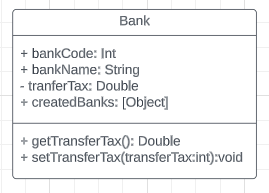
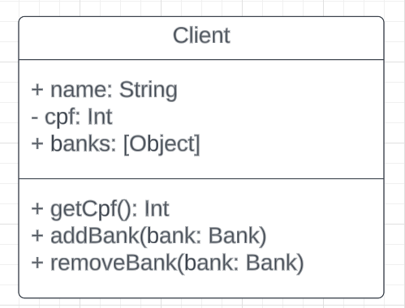
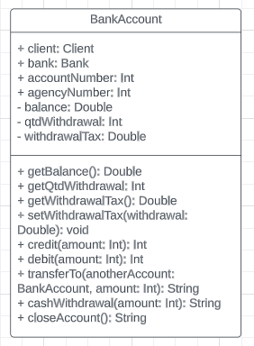

# Exercício de Casa 🏠

> ATENÇÃO: Antes de criar cada classe em código, **crie um diagrama UML** para cada uma delas seguindo as características descritas.
>
> Os diagramas podem ser criados:
>
> - No papel: nesse caso, tire fotos e coloque na pasta da sua resolução.
> - Digital, utilizando algum site tipo https://lucid.app/: nesse caso, tire print da tela ou salve os diagramas e anexe-os na sua resolução.

### Bank



Defina uma classe para um objeto `Bank`.
O banco deve possuir as seguintes propriedades:

- [ ] `bankCode`: Código do banco

  - Número do banco, recebido por parâmetro durante a instanciação.

- [ ] `bankName`: Nome do banco

  - Recebido por parâmetro durante a instanciação.

- [ ] `transferTax`: Taxa de transferência para outros bancos

  - Recebido por parâmetro durante a instanciação.
  - Deve ser um parâmetro privado.
  - Deve ter um método get e um método set.

- [ ] `createdBanks`: Bancos criados
  - Propriedade estática, sendo ela uma array de objetos que é inicialmente vazia e é atualizada a cada vez que um novo banco é criado, contendo:
    - `Código do banco criado`
    - `Quantidade de clientes que esse banco possui`
      - Esse valor deve ser inicializado com 0 e aumentar a medida que um cliente é associado a esse banco.

Exemplo de um objeto Bank:

```javascript
// A propriedade estática createdBanks é uma array vazia
// antes de nenhum banco ter sido criado:
console.log(Bank.createdBanks); // [ ]

const bank1 = new Bank(100, "LuaBank", 0.01); // Instanciação de um objeto Bank.
console.log(bank1); // { bankCode: 100, bankName: 'LuaBank' }

// Agora a propriedade estática createdBanks é uma
// array que contém 1 objeto, que corresponde ao banco criado.
// O objeto possui o código do banco e a quantidade de clientes (que inicialmente é 0):
console.log(Bank.createdBanks); // [ { bankCode: 100, qtdClients: 0 } ]

console.log(bank1.transferTax); // 0.01
bank1.transferTax = 0.02;
console.log(bank1.transferTax); // 0.02
```

### Client



Defina ainda uma classe `Client`.
A classe deve possuir as seguintes propriedades:

- [ ] `name`: Nome da pessoa

  - Recebido por parâmetro durante a instanciação.

- [ ] `cpf`: CPF

  - Recebido por parâmetro durante a instanciação.
  - Deve ser um parâmetro privado.
  - Deve ter um método get.

- [ ] `banks`: Uma array de bancos ao qual é associada
  - Deve ser inicializado vazio.

Como métodos da classe `Client`, temos:

- [ ] `addBank(bank)`: associa um banco a esse cliente.

  - O parâmetro `bank` deve obrigatoriamente ser do tipo `Bank`.
  - Verifique se o cliente já tem esse banco associado a ele. Se tiver, retorne uma mensagem e não adicione novamente.
  - Lembrar de aumentar a quantidade de clientes que esse banco possui.

- [ ] `removeBank(bank)`: desassocia um banco a esse cliente.
  - O parâmetro `bank` deve obrigatoriamente ser do tipo `Bank`.
  - Verifique se o cliente tem esse banco associado a ele. Se não tiver, retorne uma mensagem e termine a execução da função.
  - Lembrar de diminuir a quantidade de clientes que esse banco possui.

Exemplo:

```javascript
const client1 = new Client("Maria", 123); // Instanciação de um objeto Client.
console.log(client1); // { name: 'Maria', banks: [] }
console.log(client1.cpf); // 12345678900

// Adicionando um banco a um cliente
client1.addBank(bank1); // Banco 100 adicionado à cliente Maria
console.log(client1); // { name: 'Maria', banks: [ Bank { bankCode: 100, bankName: 'LuaBank' } ] }

// Removendo um banco de um cliente
client1.removeBank(bank1); // Banco 100 removido da cliente Maria
console.log(client1); // { name: 'Maria', banks: [] }
```

### BankAccount



Por fim, defina uma classe para um objeto `BankAccount`.
A conta deve possuir as seguintes propriedades:

- [ ] `client`: Cliente a qual essa conta pertence

  - O parâmetro deve obrigatoriamente ser do tipo `Client`.
  - Recebido por parâmetro durante a instanciação.

- [ ] `Bank`: Banco

  - O parâmetro deve obrigatoriamente ser do tipo `Bank`.
  - A conta só pode ser criada caso a pessoa seja cliente desse banco.
  - Recebido por parâmetro durante a instanciação.

- [ ] `accountNumber`: Número da conta
  - Recebido por parâmetro durante a instanciação.
- [ ] `agencyNumber`: Número da agência bancária
  - Recebido por parâmetro durante a instanciação.
- [ ] `balance`: O saldo

  - Deve ser inicializado com 0.
  - Deve ser um parâmetro privado.
  - Deve ter um método get.

- [ ] `qtdWithdrawal`: Quantidade de retiradas de dinheiro em bancos 24 horas

  - Deve ser inicializado com 0.
  - Deve ser um parâmetro privado.
  - Deve ter um método get.

- [ ] `withdrawalTax`: Taxa a ser cobrada em cada retirada em bancos 24 horas
  - Cada conta tem direito a realizar X (você define) retiradas gratuitas. Após isso, essa taxa começa a ser cobrada em cada retirada.
  - Deve ser inicializada com algum valor (exemplo: 0.03).
  - Deve ser um parâmetro privado.
  - Deve ter um método get e um método set.

A classe `BankAccount` possui os seguintes métodos:

- [ ] `credit(amount)`: adiciona o valor especificado ao montante.

  - Imprima na console o resultado.

- [ ] `debit(amount)`: subtrai o valor especificado do montante.

  - Imprima na console o resultado.

- [ ] `transferTo(anotherAccount, amount)`: transfere o valor especificado desta conta para a outra conta.

  - O parâmetro `anotherAccount` deve obrigatoriamente ser do tipo `BankAccount`.
  - Caso não haja valor suficiente para a operação, ela deve retornar uma mensagem para o usuário.
  - Caso a transferência seja para um banco diferente do cliente que está realizando, utilize a taxa do banco de origem.
  - Imprima na console o resultado.

- [ ] `cashWithdrawal(amount)`: realiza retiradas de dinheiro em bancos 24 horas.

  - Caso a quantidade de retiradas tenha ultrapassado o limite, a taxa deve ser cobrada.
  - A cada retirada realizada, informe ao cliente quantas retiradas ele já realizou e se ainda possui retiradas gratuitas.
    - Se sim, informe quantas.
    - Se não, informe a taxa que será cobrada a cada retirada.
  - Caso não haja valor suficiente para a operação, ela deve retornar uma mensagem para o usuário.
  - Imprima na console o resultado.

- [ ] `closeAccount()`: encerra a conta.
  - Caso a conta possua saldo não é possível encerrá-la.
  - Imprima na console o resultado.

Exemplo:

```javascript
const bankAccount1 = new BankAccount(client1, bank1, 1111, 2222); // Instanciação de um objeto BankAccount.
console.log(bankAccount1);
// {
//   client: Client { name: 'Maria', banks: [ [Bank] ] },
//   bank: Bank { bankCode: 100, bankName: 'LuaBank' },
//   accountNumber: 1111,
//   agencyNumber: 2222,
//   qtdWithdrawal: 0
// }

console.log(bankAccount1.balance); // 0
console.log(bankAccount1.qtdWithdrawal); // 0
console.log(bankAccount1.withdrawalTax); // 0.03
bankAccount1.withdrawalTax = 0.02;

// Creditando dinheiro na conta
bankAccount1.credit(1000); // O novo saldo da conta é: R$ 1000

// Debitando dinheiro da conta
bankAccount1.debit(300); // O novo saldo da conta é: R$ 700

// Transferindo de uma conta para outra
bankAccount1.transferTo(bankAccount2, 200);
// O saldo atual da conta de origem é de R$ 500
// O saldo atual da conta de destino é de R$ 200

// Retirando no banco 24 horas (cenário de 2 retiradas gratuitas)
bankAccount1.cashWithdrawal(100);
// As primeiras 2 retiradas são gratuitas.
// Retirada realizada. O saldo atual da conta é de R$ 900.
// Total de retiradas realizadas: 1
// Você ainda possui 1 retirada gratuita.

bankAccount1.cashWithdrawal(100);
// As primeiras 2 retiradas são gratuitas.
// Retirada realizada. O saldo atual da conta é de R$ 800.
// Total de retiradas realizadas: 2
// Você não possui mais nenhuma retirada gratuita.

bankAccount1.cashWithdrawal(100);
// As primeiras 2 retiradas são gratuitas.
// Retirada realizada. O saldo atual da conta é de R$ 697.
// Total de retiradas realizadas: 3
// Você não possui mais nenhuma retirada gratuita.

// Fechando a conta
bankAccount1.closeAccount(); // Conta encerrada!

console.log(bankAccount1);
// BankAccount {
//   client: undefined,
//   bank: undefined,
//   accountNumber: undefined,
//   agencyNumber: undefined,
//   qtdWithdrawal: 0
// }
```

Teste tudo o que foi criado.

---

Terminou o exercício? Dá uma olhada nessa checklist e confere se tá tudo certinho, combinado?!

- [ ] Fiz o fork do repositório.
- [ ] Clonei o fork na minha máquina (`git clone url-do-meu-fork`).
- [ ] Criei minha branch (`git checkout -b nome-sobrenome`)
- [ ] Criei a pasta com o meu nome dentro da pasta entregas (` mkdir nome-sobrenome`)
- [ ] Resolvi o exercício dentro da minha pasta. Como no [exemplo](./entregas/exemplo-nome-sobrenome/).
- [ ] Adicionei as mudanças. (`git add .` para adicionar todos os arquivos, ou `git add nome_do_arquivo` para adicionar um arquivo específico)
- [ ] Commitei a cada mudança significativa ou na finalização do exercício (`git commit -m "Mensagem do commit"`)
- [ ] Pushei os commits na minha branch (`git push origin nome-da-branch`)
- [ ] Criei um Pull Request seguindo as orientações que estao nesse [documento](./instrucoes-pull-request.md).
