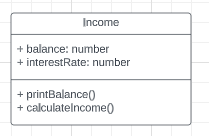

# Exercício de Sala 🏫

- Conteúdo teórico:
  [Abstração](../../../5.%20Introdu%C3%A7%C3%A3o%20%C3%A0%20Orienta%C3%A7%C3%A3o%20a%20Objeto%20I/5.3%20-%20Abstra%C3%A7%C3%A3o.md)

## Exercício 4

Crie a classe `Income` que possui atributos:

- [ ] balance (saldo)
- [ ] interestRate (taxa de juros).

O saldo e a taxa de juros são passados ao construtor como parâmetros (initialBalance e initialInterestRate).

Crie os métodos:

- [ ] printBalance()
- [ ] calculateIncome()

O método `printBalance` imprime o saldo atual e o método `calculateIncome` aumenta o valor do rendimento. A rendimento é aumentada multiplicando o saldo pela taxa de juros.

Teste o que foi criado.

Crie o diagrama UML representando a class Income.

Perceba que o diagrama UML é uma abstração da classe que foi criada. Quem o ler, não precisará saber como os métodos foram implementados, apenas quais são os métodos existentes e qual o resultado final dele.

---

Terminou o exercício? Dá uma olhada nessa checklist e confere se tá tudo certinho, combinado?!

- [OK] Fiz o fork do repositório.
- [OK] Clonei o fork na minha máquina (`git clone url-do-meu-fork`).
- [OK] Resolvi o exercício dentro da pasta resolução.
- [OK] Adicionei as mudanças. (`git add .` para adicionar todos os arquivos, ou `git add nome_do_arquivo` para adicionar um arquivo específico)
- [OK] Commitei a cada mudança significativa ou na finalização do exercício (`git commit -m "Mensagem do commit"`)
- [OK] Pushei os commits na minha branch (`git push origin nome-da-branch`)
